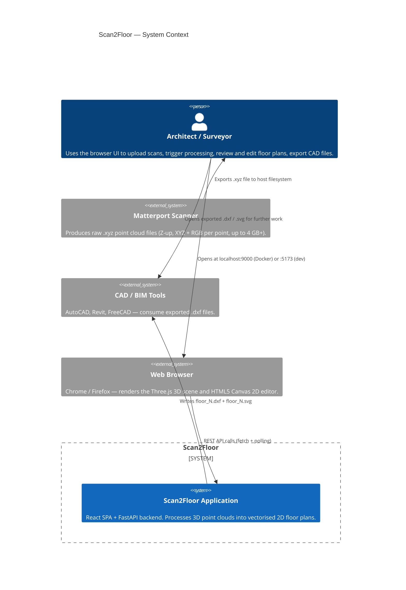
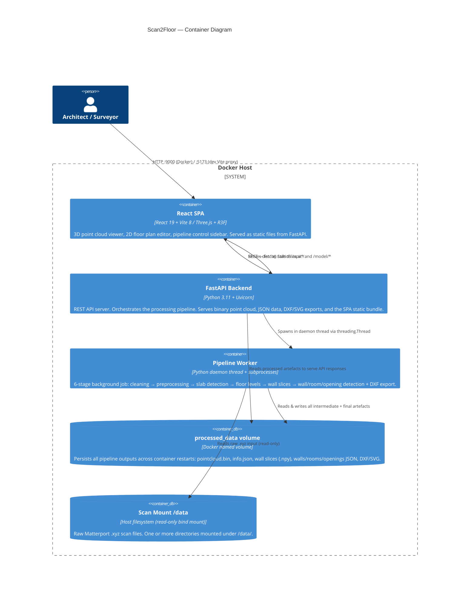
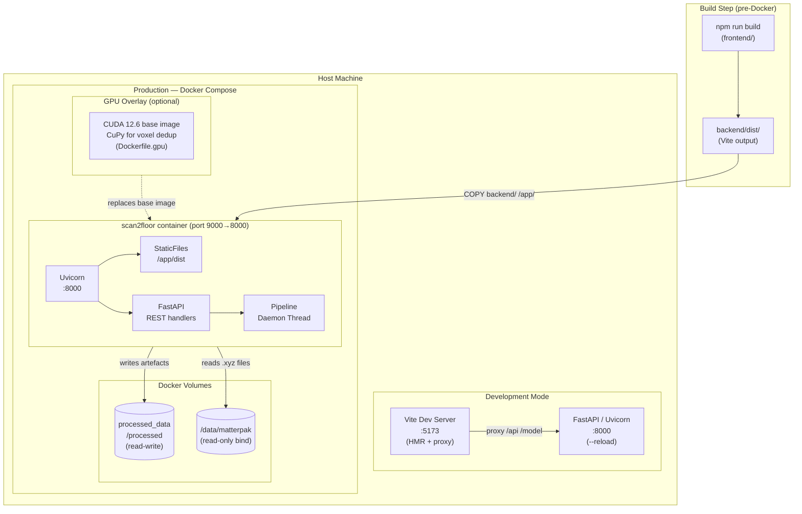
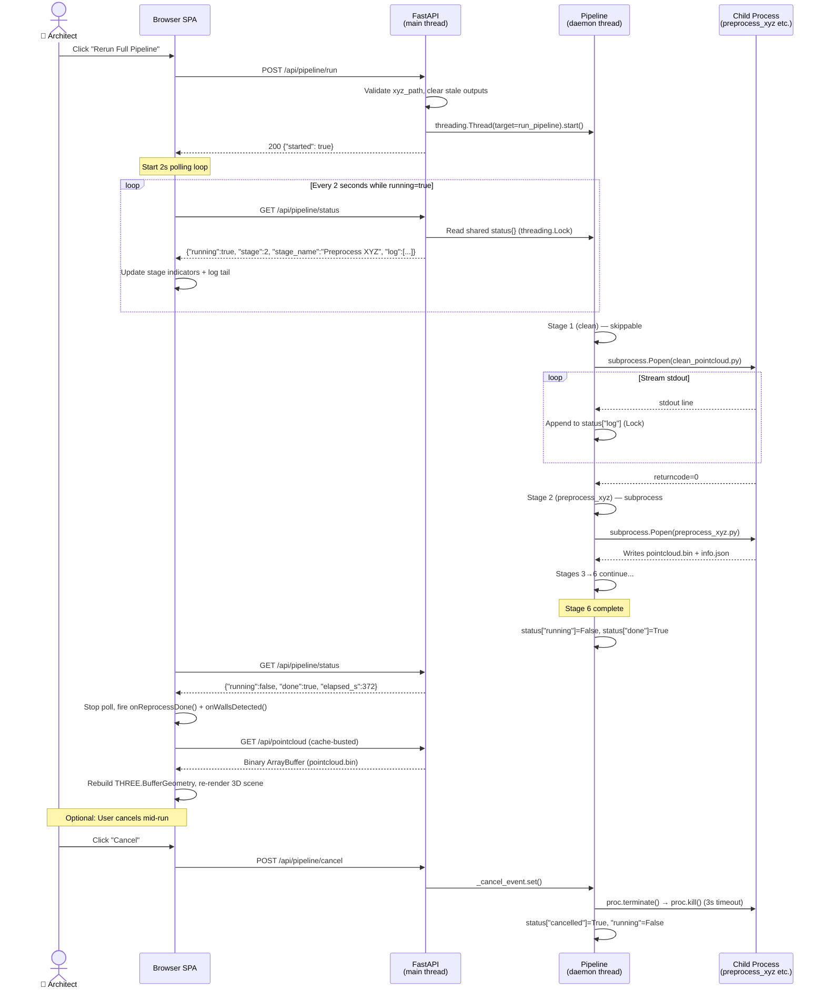

# Scan2Floor — System Architecture & Data Flow

> **Document scope:** This document covers the end-to-end system architecture of Scan2Floor, from raw Matterport `.xyz` input to interactive browser visualisation and CAD export. It is intended for developers who need to understand how the pieces fit together before making changes.
>
> **Companion documents:**
>
> - [Architecture Decision Records →](./adr/README.md)
> - [API Documentation →](../API_DOCUMENTATION_CZ.md)
> - [Component-level reference →](../ARCHITECTURE.md)

---

## 1. System Context

The highest-level view of Scan2Floor and everything it interacts with.

---

## 2. Container Diagram

The two runtime containers and the persistent storage that connects them.

---

## 3. Deployment Topology

How the application runs in practice — both development and production modes.

> **Key environment variables** injected by `docker-compose.yml`:
>
> | Variable | Default | Purpose |
> | ---------- | --------- | --------- |
> | `PROCESSED_DIR` | `/processed` | Root for all pipeline output files |
> | `DATA_DIR` | `/data/matterpak` | Fallback scan folder |
> | `C2B_DIR` | `/processed/c2b_output` | Cloud2BIM slab surface output |
> | `SCAN_ROOTS` | `/data` | Comma-separated roots walked by the file browser |

---

## 4. Pipeline — Stage Flow

The 6-stage background processing pipeline that transforms a raw `.xyz` file into all output artefacts.

```mermaid
flowchart LR
    XYZ["📄 cloud.xyz\nRaw Matterport scan\nZ-up · up to 4 GB"]

    subgraph S1["Stage 1 — subprocess"]
        C["clean_pointcloud.py\nNoise & scanner-stand\nremoval · downsample"]
    end

    subgraph S2["Stage 2 — subprocess"]
        P["preprocess_xyz.py\nZ-up → Y-up · centroid\nfloor histogram · binary export"]
    end

    subgraph S3["Stage 3 — subprocess"]
        C2B["run_c2b.py\nCloud2BIM reimpl.\nHoriz. slab detection"]
    end

    subgraph S4["Stage 4 — in-process"]
        FC["floor_from_c2b.py\nSlab pairing · precise\nfloor_levels update"]
    end

    subgraph S5["Stage 5 — subprocess"]
        PW["preprocess_walls.py\nPer-floor height band\nvoxel dedup (CPU/GPU)"]
    end

    subgraph S6["Stage 6 — in-process"]
        WD["wall_detection_c2b.py\nDensity projection\nwall segments"]
        OD["opening_detection.py\nDoor / window\ngap scanning"]
        RD["room_detection.py\nMorphological\nregion labelling"]
        DX["dxf_export.py\nezdxf · DXF layers\nSVG preview"]
    end

    XYZ --> C
    C --> P
    P --> C2B
    C2B --> FC
    FC --> PW
    PW --> WD
    WD --> OD
    OD --> RD
    RD --> DX

    P -- "pointcloud.bin\ninfo.json (prelim)" --> BIN[("📦 /processed")]
    C2B -- "horiz_surface_N.xyz" --> BIN
    FC -- "info.json updated\nfloor_levels[]" --> BIN
    PW -- "wall_slice_floor_N.npy" --> BIN
    WD -- "walls_floor_N.json" --> BIN
    OD -- "openings_floor_N.json" --> BIN
    RD -- "rooms_floor_N.json" --> BIN
    DX -- "floor_N.dxf\nfloor_N.svg" --> BIN

    style S1 fill:#1a2040,stroke:#334477
    style S2 fill:#1a2040,stroke:#334477
    style S3 fill:#1a2040,stroke:#334477
    style S4 fill:#0d2030,stroke:#2a5070
    style S5 fill:#1a2040,stroke:#334477
    style S6 fill:#0d2030,stroke:#2a5070
    style BIN fill:#0a1525,stroke:#1a4060
```

> **Stage execution model:**
>
> - **Subprocess stages** (1, 2, 3, 5): spawned via `subprocess.Popen` — stdout is streamed line-by-line into the shared log buffer and the pipeline can be cancelled between lines via `_cancel_event`.
> - **In-process stages** (4, 6): Python functions called directly in the daemon thread — faster, no subprocess overhead, but cancellation is checked at stage boundaries only.

---

## 5. Pipeline Concurrency & Status Flow

How the FastAPI main thread, the pipeline daemon thread, subprocesses, and the browser polling loop interact over time.

---

*Generated: 2026-08-18.
