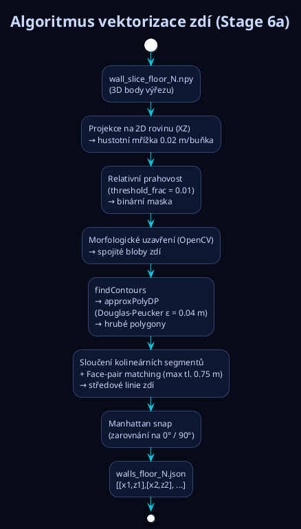

```plantuml
@startuml
left to right direction

title Scan2Floor — Datový tok artefaktů

rectangle "/data (read-only)" as data {
  file "cloud.xyz" as xyz
}

rectangle "/processed (read-write)" as proc {
  file "cloud_cleaned.xyz" as cleaned
  file "pointcloud.bin\ninfo.json" as bin
  file "horiz_surface_N.xyz" as surf
  file "wall_slice_floor_N.npy" as npy
  file "walls_floor_N.json\nopenings_floor_N.json\nrooms_floor_N.json" as json
  file "floor_N.dxf\nfloor_N.svg" as dxf
  folder "saves/<name>/" as saves
}

xyz --> cleaned : Stage 1 (clean)
cleaned --> bin  : Stage 2 (preprocess)
bin --> surf     : Stage 3 (C2B slabs)
surf --> npy     : Stage 4+5 (floor levels\n+ wall slices)
npy --> json     : Stage 6a–c (walls,\nopenings, rooms)
json --> dxf     : Stage 6d (DXF export)
dxf --> saves    : /api/saves (POST)
@enduml
```

# Scan2Floor — Prezentační skript (10 minut)

> **Formát:** Pro každý slide: (1) Název slidu, (2) Obsah na obrazovce, (3) Skript pro prezentujícího v češtině.  
> **Celkový čas:** ~10 minut | 14 slidů

---

## Slide 1 — Titulní slide

### Obsah na obrazovce
```
SCAN2FLOOR
Point cloud → 2D vektorový půdorys

Automatická vektorizace architektonických plánů
z Matterport 3D skenů

[vizuál: mrak bodů přecházející v čistý CAD výkres]
```

### 🎙️ Skript pro prezentujícího (CZ)
> Ahoj, dneska vám ukážu Scan2Floor — systém, který bere surový 3D mrak bodů z Matterport skeneru a automaticky z něj vygeneruje 2D půdorys. Žádná manuální práce — stačí nahrát scan, kliknout a výstupem je DXF s zdmi, dveřmi, okny a místnostmi, které rovnou otevřete v AutoCADu nebo Revitu.

---

## Slide 2 — Přehled projektu & funkce

### Obsah na obrazovce
```
SCAN2FLOOR — CO UMOŽŇUJE

  3D Prohlížeč            Editace půdorysu
  ─────────────           ────────────────
  • Three.js point cloud  • Kreslení/mazání zdí
  • OBJ mesh overlay      • Snap na koncový bod
  • Clipping plane        • Hold & drag smazání
  • OrbitControls         • Skrytí zdí (bez smazání)
                          • Undo / Redo

  Pipeline                Export
  ────────                ──────
  • 6 fází, 1 klik        • DXF (A-WALL, A-DOOR,
  • Live progress log       A-WINDOW, A-ROOM)
  • Zrušení za běhu       • SVG náhled
  • GPU akcelerace        • Uložení výstupu (Saves)

[screenshot aplikace]
```

### 🎙️ Skript pro prezentujícího (CZ)
> Rychlý přehled co to umí. 3D pohled, kde vidíte celý mrak bodů, a 2D editor kde zdi ručně dolaďujete — přidáte, smažete, nebo skryjete zeď aniž byste ji museli fyzicky mazat. Celé zpracování běží na pozadí v šesti fázích, progress vidíte živě. Výstup je DXF a SVG, a nově si můžete uložit výsledky pod konkrétním jménem a pak se k nim vrátit.

---

## Slide 3 — Architektura systému

### Obsah na obrazovce

```plantuml
@startuml
!include https://raw.githubusercontent.com/plantuml-stdlib/C4-PlantUML/master/C4_Container.puml

LAYOUT_LEFT_RIGHT()
title Scan2Floor — Container Diagram

Person(arch, "Architekt / Zeměměřič")

System_Boundary(docker, "Docker Container (port 9000)") {
    Container(spa, "React 19 SPA", "Vite 8 · Three.js · HTML5 Canvas", "3D viewer, 2D editor, pipeline panel")
    Container(api, "FastAPI Backend", "Python 3.11 · Uvicorn", "REST API, pipeline orchestrator")
    Container(worker, "Pipeline Worker", "Daemon Thread + Subprocesses", "6 stages: clean → slice → vectorise")
    ContainerDb(proc, "/processed", "Docker named volume (rw)", "Mezivýsledky, DXF, SVG, Saves")
    ContainerDb(data, "/data", "Host bind mount (ro)", "Vstupní .xyz soubory")
}

Rel(arch, spa, "HTTP :9000")
Rel(spa, api, "REST /api/*")
Rel(api, worker, "daemon thread")
Rel(worker, proc, "čte & zapisuje artefakty")
Rel(worker, data, "čte .xyz (read-only)")
Rel(api, proc, "servíruje výsledky")
@enduml
```

### 🎙️ Skript pro prezentujícího (CZ)
> Architektura je docela jednoduchá. Jeden Docker kontejner — uvnitř React frontend, FastAPI backend a pipeline worker jako daemon thread. Data jsou na dvou volumes: read-only mount pro vstupní XYZ soubory, a read-write volume kam jdou všechny výstupy. Frontend polluje backend každých sedm sekund a aktualizuje stav pipeline.

---

## Slide 4 — Pipeline: přehled 6 fází

### Obsah na obrazovce
```
ZPRACOVACÍ PIPELINE — 6 FÁZÍ

  cloud.xyz (~4 GB, ~114M bodů)
       │
  [1]  clean_pointcloud.py     ← strukturální filter + downsampling
       │  cloud_cleaned.xyz
  [2]  preprocess_xyz.py       ← coord. transformace, binární export
       │  pointcloud.bin + info.json
  [3]  run_c2b.py              ← detekce podlah a stropů (C2B algoritmus)
       │  horiz_surface_N.xyz
  [4]  floor_from_c2b.py       ← přesné výšky podlaží
       │  info.json (aktualizováno)
  [5]  preprocess_walls.py     ← výřezy per-podlaží, GPU voxel dedup
       │  wall_slice_floor_N.npy
  [6]  wall_detection + rooms  ← vektorizace zdí, místnosti, DXF
       │
  floor_N.dxf + floor_N.svg

  CPU: ~9–12 min  |  GPU (CuPy): ~7 min
```

### 🎙️ Skript pro prezentujícího (CZ)
> Pipeline je sekvenční — šest kroků, každý bere výstupy předchozího. Na typickém hardware to trvá 7 minut s GPU nebo 10 minut bez. Pojďme si projít co každá fáze dělá.

---

## Slide 5 — Fáze 1: Čištění mraku bodů

### Obsah na obrazovce
```
FÁZE 1 — ČIŠTĚNÍ MRAKU BODŮ
clean_pointcloud.py

  VSTUP: cloud.xyz (surový sken, vč. nábytku)

  Algoritmus:
  • Grid rozdělení prostoru
  • Každá buňka → vertikální histogram výšek
  • Zachovej jen sloupce pokrývající 65–100 % výšky podlaží
    → odstraní nábytek, stojany, artefakty
  • Náhodný downsampling (default 20 %)

  VÝSTUP: cloud_cleaned.xyz

  [vizuál: PŘED (s nábytkem) vs. PO (čistý)]
```

### 🎙️ Skript pro prezentujícího (CZ)
> Vstupní sken obsahuje vše — i nábytek a stojany skeneru. Algoritmus rozdělí prostor na grid buněk a v každé zkontroluje výšku bodů. Zachovají se jen sloupce s výškou 65 až 100 % podlaží — to jsou zdi a sloupy. Nábytek nikdy nedosahuje stropu, takže vypadne automaticky. Plus se data vzorkují na 20 %, aby byly další fáze rychlejší.

---

## Slide 6 — Fáze 2 & 3: Preprocessing a detekce desek

### Obsah na obrazovce
```
FÁZE 2 — XYZ PREPROCESSING
preprocess_xyz.py

  • 2-pass pandas C-engine streaming  (~8–12M řádků/s)
  • Pass 1: centroid bez načtení celého souboru do RAM
  • Pass 2: Z-up → Y-up, centrování, downsampling 1:N
  • Výstup: pointcloud.bin + info.json (bounding box, floor hints)

━━━━━━━━━━━━━━━━━━━━━━━━━━━━━━━━━━━━━━━━━━━

FÁZE 3 — DETEKCE HORIZONTÁLNÍCH PLOCH (C2B)
run_c2b.py  [reimplementace Cloud2BIM, bez ext. závislosti]

  • Z-osa histogram, krok 0.15 m
  • Pásma nad 60 % peaku hustoty → podlahy + stropy
  • Výstup: horiz_surface_N.xyz
```

### 🎙️ Skript pro prezentujícího (CZ)
> Fáze 2 transformuje data do správného souřadnicového systému a exportuje binární soubor pro Three.js viewer. Čteme dvěma průchody přes pandas C-engine — 8 až 12 milionů řádků za sekundu, bez nutnosti mít celý soubor v paměti. Fáze 3 pak detekuje podlahy a stropy — postaví Z-ový histogram a v hustých vodorovných vrstvách najde betonové desky. Celý Cloud2BIM algoritmus je zabudovaný, žádná externí instalace.

---

## Slide 7 — Fáze 4 & 5: Výšky podlaží a wall slices

### Obsah na obrazovce
```
FÁZE 4 — VÝŠKY PODLAŽÍ
floor_from_c2b.py

  • Medián Z každé detekované desky
  • Spárování: dolní deska = podlaha, horní = strop
  • info.json ← { floor_y, ceiling_y, storey_height } per podlaží

━━━━━━━━━━━━━━━━━━━━━━━━━━━━━━━━━━━━━━━━━━━

FÁZE 5 — WALL SLICES (GPU akcelerovaná)
preprocess_walls.py

  • Chunked streaming 2M řádků najednou
  • Výřez pásma [floor_y − 0.05, floor_y + 2.65 m] per podlaží
  • Voxel dedup:
      GPU: 3× int32 → 1× int64 klíč → cp.unique (radix sort)
           ~3× méně VRAM, 5–10× rychleji
      CPU: np.unique na 1D int64 (fallback)
  • Výstup: wall_slice_floor_N.npy
```

### 🎙️ Skript pro prezentujícího (CZ)
> Fáze 4 zpřesní výšky podlaží z detekovaných desek. Fáze 5 je výpočetně nejnáročnější — vyřízne z celého mraku bodů tenký horizontální pás pro každé podlaží a voxelizuje ho. Klíčová GPU optimalizace: tři 32-bitové indexy zabalíme do jednoho 64-bitového čísla a spustíme radix sort, což je několikanásobně rychlejší a méně paměťově náročné než naivní přístup.

---

## Slide 8 — Fáze 6: Vektorizace zdí, místností a export

### Obsah na obrazovce
```
FÁZE 6 — DETEKCE ZDÍ, MÍSTNOSTÍ & DXF EXPORT

  6a  wall_detection_c2b.py
      • 2D projekce → hustotní mřížka (0.02 m/buňka)
      • Binární maska → morfologické uzavření
      • findContours + Douglas-Peucker (ε = 0.04 m)
      • Kolineární merge → face-pair → středová linie
      • Manhattan snap (0° / 90°)

  6b  opening_detection.py
      • UV projekce na rovinu zdi
      • Sloupcové skenování svislých mezer → dveře / okna

  6c  room_detection.py
      • Rasterizace zdí, morfologické uzavření
      • connectedComponents → místnosti + plocha (m²)

  6d  dxf_export.py
      • Vrstvy: A-WALL  A-DOOR  A-WINDOW  A-ROOM
      • floor_N.dxf + floor_N.svg
```

### 🎙️ Skript pro prezentujícího (CZ)
> Šestá fáze je algoritmicky nejzajímavější. Body promítneme na 2D mřížku, prahujeme, aplikujeme morfologické operace a z kontur vytvoříme vektorové segmenty zdí. Dveře a okna se najdou jako mezery ve svislém profilu každé zdi. Místnosti pak vzniknou uzavřením zdí a connected components labelingem. Výstup jsou čtyři DXF vrstvy.

---

## Slide 9 — 🟢 DEMO: Výsledky prvního scanu

### Obsah na obrazovce
```
▶  DEMO — PRVNÍ MRAK BODŮ (výsledky připraveny)

  • 3D pohled — point cloud + mesh overlay
  • Přepnutí na Vector Floor Plan
  • Detekované zdi (cyan), dveře, okna
  • Room List Panel — plochy místností v m²
  • Download DXF

[živá ukázka]
```

### 🎙️ Skript pro prezentujícího (CZ)
> Tak, výsledky prvního scanu jsou připravené. Tohle je 3D viewer — point cloud v Three.js, přes něj namapovaný mesh. Přepneme na 2D Vector Floor Plan — tady jsou automaticky detekované zdi v cyanu, dveře a okna. V pravém panelu je seznam místností s plochami v metrech čtverečních. A tady stáhneme DXF — otevřete ho přímo v AutoCADu.

---

## Slide 10 — Tech stack (FRONTEND)

### Obsah na obrazovce
```
TECH STACK — FRONTEND

  React 19 + Vite 8
  Three.js 0.183  ·  @react-three/fiber 9  ·  @react-three/drei 10
  Vanilla CSS  ·  HTML5 Canvas API

  Klíčové komponenty:
  • PointCloud.jsx     → Three.js renderer, pointcloud.bin reader
  • FloorPlanViewer    → Canvas editor (pan/add/delete/hide, undo/redo)
  • RoomListPanel      → seznam místností + klik → highlight + camera fly-to
  • Sidebar.jsx        → pipeline controls, progress, live log, Saves panel
  • App.jsx            → polling loop 7s, 3D↔2D switching
```

### 🎙️ Skript pro prezentujícího (CZ)
> Frontend stojí na Reactu 19 s Vitem. Three.js obstarává 3D rendering, HTML5 Canvas editor je postavený bez žádné kreslící knihovny. Nový přírůstek je panel Saves v Sidebaru — zobrazuje uložené výstupy, každý se jménem a počtem podlaží.

---

## Slide 11 — Tech stack (BACKEND)

### Obsah na obrazovce
```
TECH STACK — BACKEND

  FastAPI + Uvicorn       Python 3.11
  NumPy                   hustotní mřížky, voxely
  Pandas (C engine)       streaming XYZ souborů
  OpenCV                  morfologie, kontury
  SciPy                   histogram peak-finding
  ezdxf                   generování DXF
  Open3D                  (legacy I/O)
  CuPy  [optional]        GPU voxel dedup

  Deployment:
  • Docker CPU  /  Docker + CUDA 12.6 GPU
  • Jeden příkaz: docker-build.bat → http://localhost:9000
```

### 🎙️ Skript pro prezentujícího (CZ)
> Na backendu je FastAPI s Uvicornem. Pandas C-engine zvládne streamovat gigabajtové soubory efektivně. OpenCV řeší morfologické operace, ezdxf generuje CAD výstupy. CuPy je volitelné — přidá GPU akceleraci fáze 5 na libovolné NVIDIA GPU. Celé nasazení je jedno .bat volání.

---

## Slide 12 — Nové funkce

### Obsah na obrazovce
```
NOVÉ FUNKCE

  💾  OUTPUT SAVE
      • Uložení výsledků pod pojmenovanou složku
      • /api/saves  (GET seznam / POST vytvoř)
      • Ukládá: zdi, místnosti, otvory, DXF, SVG, info.json
      • Pojmenování = adresář vstupního scanu (nebo vlastní název)

  ─────────────────────────────────────────────────

  👁  HIDE MODE & HOLD-AND-DRAG DELETE
      Vector Floor Plan Editor

      Hide (H):   skryje zeď ze zobrazení i z výpočtu místností
                  → zeď zůstane jako dashed slate-grey linie
                  → kdykoli ji znovu zobrazíte
      Delete (D): kliknutí nebo hold & drag přes více zdí najednou
```

### 🎙️ Skript pro prezentujícího (CZ)
> Dvě nové věci, které přibyly od posledního přehledu. Output Save — výsledky si uložíte pod jménem scanu, takže se k nim můžete kdykoliv vrátit bez nutnosti přepouštět celou pipeline. A v editoru půdorysu přibyly dva vylepšené módy: Hold and drag v Delete módu smaže najednou všechny zdi, přes které přejedete. A nový Hide mód zeď nezmaže, jen ji schová — nebere se do výpočtu místností, ale stále ji vidíte jako přerušovanou linku. Hodí se třeba pro mezilehlé sloupce nebo atypické prvky.

---

## Slide 13 — Datový tok (diagram)

### Obsah na obrazovce



### 🎙️ Skript pro prezentujícího (CZ)
> Tady vidíte jak data tečou přes systém. Vstup je read-only — pipeline ho nikdy nemodifikuje. Každá fáze produkuje soubory, které bere ta následující. Na konci jsou DXF a JSON soubory, které si pak uložíte do pojmenované složky přes Output Save.

---

## Slide 14 — Algoritmus detekce zdí (diagram)

### Obsah na obrazovce



### 🎙️ Skript pro prezentujícího (CZ)
> Algoritmus detekce zdí v kostce: promítneme 3D body na 2D hustotní mřížku, prahujeme, morfologické uzavření vyplní mezery v tenkých zdech. Kontury najdeme přes OpenCV findContours, zjednodušíme je Douglas-Peuckerem. Protilehlé stěny zdi spárujeme a z každého páru vytvoříme středovou linii. Nakonec zasnappujeme na manhatanskou mřížku. Výstup je list párů souřadnic — začátek a konec každé zdi.

---

## Slide 15 — Výkonnost & závěr

### Obsah na obrazovce
```
VÝKONNOST — 114M bodů / ~4.4 GB

  Fáze              CPU          GPU (CuPy)
  ────────────────────────────────────────
  1 — Čištění       ~1–2 min     ~1–2 min
  2 — Preprocessing ~2 min       ~2 min
  3 — C2B slabs     ~2 min       ~2 min
  4 — Floor levels  < 1 s        < 1 s
  5 — Wall slices   ~3–4 min     ~1–2 min  ← hlavní GPU zisk
  6 — Detekce zdí   ~1–2 min     ~1–2 min
  ────────────────────────────────────────
  CELKEM            ~9–12 min    ~7 min

  Known limitations:
  • Zahnuté zdi → aproximace polygonem
  • Schodiště → možná misklasifikace jako velká místnost

  Potenciál: IFC export · ML detekce zdí · Cloud deployment

  Děkuji. Otázky?
```

### 🎙️ Skript pro prezentujícího (CZ)
> Na závěr — výkonnost. Sedm minut s GPU, deset bez. Největší zisk GPU je ve fázi 5 na voxelizaci. Systém má svá omezení — zahnuté zdi jsou aproximovány polygonem, schodiště se může špatně detekovat jako místnost. Do budoucna vidím potenciál v ML přístupu pro detekci zdí a v IFC exportu pro přímou integraci s BIM. Díky za pozornost, rád odpovím na dotazy.

---

## 📊 Časový harmonogram

| Čas | Slide | Obsah |
|-----|-------|-------|
| 0:00–0:40 | 1 | Úvod |
| 0:40–1:20 | 2 | Přehled funkcí (vč. nových) |
| 1:20–2:00 | 3 | Architektura (C4 diagram) |
| 2:00–2:30 | 4 | Pipeline přehled |
| 2:30–4:30 | 5–8 | Fáze 1–6 podrobně |
| 4:30–5:30 | 9 | **DEMO** — výsledky 1. scanu |
| 5:30–6:30 | 10–11 | Tech stack (FE + BE) |
| 6:30–7:30 | 12 | Nové funkce (Output Save + Hide) |
| 7:30–8:30 | 13–14 | Diagramy (datový tok + wall algo) |
| 8:30–10:00 | 15 | Výkonnost, limity, závěr + otázky |
